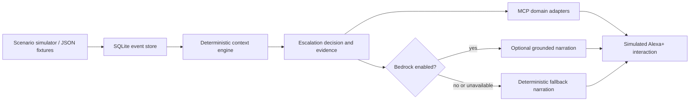

# NightWatch

NightWatch is a context-aware home safety and alerting prototype for the Amazon Developer Hackathon 2026. It receives simulated Ring motion events, evaluates them against household context and a baseline, creates an explainable escalation decision, and drives a simulated Alexa alert. It deliberately reports **unusual activity** rather than claiming to identify a burglary, crime, or emergency.

## Milestone 1: local vertical slice

This first milestone is intentionally credential-free and simulator-only:

```text
Ring simulator
  → tRPC backend procedure
  → normalized SQLite-backed event store
  → deterministic context engine
  → escalation decision
  → simulated Alexa alert
  → grounded "Why did you wake me?" explanation
```

### Current architecture



The context engine remains the authority for scoring and escalation. Bedrock, when enabled, can phrase grounded narration but cannot change the decision. The diagram shows current local behavior; it does not imply live Ring, Alexa/Echo, Alexa+, or Amazon service connectivity beyond the explicitly configured Bedrock path.

The dashboard communicates with the backend router. It does not call the context engine directly. The context engine is deterministic and is the authority for escalation; future AI can interpret context and generate language, but it must not be the sole authority for safety-critical escalation.

## Current status and deliberate limitations

| Integration | Status in this milestone |
| --- | --- |
| Ring | Simulator only; no live Ring credentials or undocumented API assumptions |
| Alexa+ | Simulated bedroom device and alert button only |
| AWS | Optional Bedrock narration; disabled by default |
| MCP | Streamable HTTP boundary targeting MCP `2025-11-25`; local experimental deployment |
| Persistence | Local SQLite store at `data/nightwatch.sqlite` |
| Transport | WebDev's type-safe tRPC procedure boundary; the domain layer is isolated so REST/FastAPI or another transport can be added without moving UI logic |

| Capability | Current implementation |
| --- | --- |
| Ring events | Simulated normalized events and repository fixtures; no live Ring service connection |
| Context and escalation | Real deterministic NightWatch domain logic over persisted SQLite state |
| MCP | Real local Streamable HTTP server and SDK client verification; not an Alexa+ deployment |
| Bedrock | Real optional server-side Converse API path when explicitly configured; deterministic fallback by default |
| Alexa/Echo | Simulated interaction panel only; no physical device control |

The WebDev full-stack scaffold uses a Node/TypeScript server and the platform-native server boundary. Business logic is kept in small modules under `server/nightwatch/`. Persistence uses Node 22's built-in `node:sqlite` API, with no native SQLite npm dependency. Optional Bedrock narration runs server-side and receives only the deterministic NightWatch context needed to phrase a response.

## Milestone 3: MCP boundary

The official `@modelcontextprotocol/sdk` provides the transport and protocol handling. NightWatch mounts a stateless `POST /mcp` Streamable HTTP endpoint and exposes four read-oriented tools: `get_recent_events`, `get_home_context`, `assess_activity`, and `get_alert_explanation`. The tool handlers call the existing `store.ts` functions, which reload SQLite state and invoke the deterministic context engine. The MCP layer does not contain scoring, escalation, persistence, or explanation business logic.

This is an **experimental local MCP boundary** targeting MCP `2025-11-25`. It is tested in-process and with an HTTP initialization smoke test, but it is not an Alexa+ deployment, a physical Alexa integration, or a certification/compliance claim.


## Milestone 5: MCP Alexa+ readiness hardening

NightWatch explicitly targets MCP protocol version `2025-11-25`. The official SDK negotiates this version during initialization, and the client smoke test fails if a different version is returned. Each tool declares a small output schema and returns validated `structuredContent` alongside readable text content:

| Tool | Structured output |
| --- | --- |
| `get_recent_events` | `events`, `totalAvailable`, and SQLite `source` |
| `get_home_context` | Household state, scenario, baseline, latest event/alert, and integration status |
| `assess_activity` | Deterministic assessment, escalation decision, source event IDs, and authority marker |
| `get_alert_explanation` | Question, answer, evidence, and source event IDs |

The implementation satisfies the **local MCP checks** exercised here: initialization, protocol negotiation, `tools/list`, `tools/call`, Streamable HTTP, and structured-output validation. These local checks do not establish Alexa+ onboarding, certification, Amazon approval, or compatibility with a physical Alexa/Echo device. Remote deployment, authentication, onboarding, and any external review remain outside this repository milestone.

## Milestone 6: simulated Alexa+ interaction experience

NightWatch now includes a local **“Alexa+ interaction simulation — powered by NightWatch MCP”** panel. It is intentionally a simulation rather than a live Alexa+ connection. When a scenario is run, the simulated Alexa layer calls the existing NightWatch MCP tool adapters for home context, assessment, and recent events. It then renders a grounded alert briefing and exposes the tool names, returned evidence, and source event IDs used for that response.

The conversation supports “Why did you wake me?”, “What happened?”, “How many events were detected?”, “Where did they happen?”, and “Was this unusual compared with the baseline?”. Unsupported questions receive a bounded explanation of the supported scope. Responses are generated from the current persisted NightWatch state; the interaction layer does not invent events, locations, timestamps, or escalation reasoning. The deterministic context engine remains the only escalation authority.

The judging path is: run **3 AM activity**, observe the three front-entrance motion events and unusual-activity decision, then read the simulated Alexa briefing and ask **Why did you wake me?**. The follow-up cites the actual household state, event timing, frequency, location, and baseline factors returned by NightWatch.

This milestone does not connect to Alexa or an Echo, does not wake or target a physical device, and does not claim Alexa+ certification, Amazon approval, or live Alexa+ connectivity. A real integration remains dependent on Alexa+ developer access, a remote authenticated HTTPS MCP deployment, add-on onboarding, and Amazon’s review process.

## Step 7: optional AWS AI narration

NightWatch now has an optional **Amazon Bedrock Runtime Converse API** narration provider. This is a server-side AI capability for natural-language narration only; it does not replace the deterministic context engine, change a score, classify activity, create an escalation, or control Alexa/Echo hardware. The existing Alexa+ interaction simulation remains fully functional without AWS.

The request flow is:

```text
SQLite-backed NightWatch state
  → MCP/domain adapters
  → deterministic assessment, decision, and evidence
  → optional Bedrock Converse narration
  → simulated Alexa+ response
```

Bedrock receives a compact structured payload containing the current household state, baseline, event IDs/timestamps/locations, assessment, deterministic decision, and explanation evidence. Its output is used only as natural-language narration. The authoritative score, classification, escalation flag, priority, evidence, and source event IDs remain generated by NightWatch and are returned separately. The prompt prohibits invented events, timestamps, locations, sensor readings, household state, reasons, burglary/crime/emergency claims, or person identity claims.

AI is disabled by default. To enable it locally, configure the following **server-side** variables without committing them:

```bash
NIGHTWATCH_AI_ENABLED=true
AWS_REGION=us-east-1
NIGHTWATCH_BEDROCK_MODEL_ID=your-enabled-bedrock-model-id
NIGHTWATCH_AI_TIMEOUT_MS=5000
```

The AWS SDK uses its standard credential provider chain. Local development may use an AWS profile or environment-provided temporary credentials; deployed workloads should use an IAM role or equivalent workload identity. Do not put credentials in source code, the client bundle, README examples, or committed `.env` files. The Bedrock identity needs `bedrock:InvokeModel`, and model availability/access depends on the selected AWS Region and account prerequisites. See the [Bedrock Converse API](https://docs.aws.amazon.com/bedrock/latest/APIReference/API_runtime_Converse.html) and [Bedrock model access documentation](https://docs.aws.amazon.com/bedrock/latest/userguide/model-access.html).

When `NIGHTWATCH_AI_ENABLED=false`, region/model configuration is incomplete, the request times out, or Bedrock rejects the request, NightWatch returns the existing deterministic Alexa simulation response. No raw AWS error is returned to the client, and no deterministic NightWatch state is mutated by the provider. This milestone does not add Bedrock Agents, Knowledge Bases, OpenSearch, SageMaker, Lambda, live Ring integration, physical Alexa/Echo control, Alexa+ certification, Amazon approval, or production safety capabilities.

## Milestone 5: MCP Alexa+ readiness hardening

NightWatch explicitly targets MCP protocol version `2025-11-25`. The official SDK negotiates this version during initialization, and the client smoke test fails if a different version is returned. Each tool declares a small output schema and returns validated `structuredContent` alongside readable text content:

| Tool | Structured output |
| --- | --- |
| `get_recent_events` | `events`, `totalAvailable`, and SQLite `source` |
| `get_home_context` | Household state, scenario, baseline, latest event/alert, and integration status |
| `assess_activity` | Deterministic assessment, escalation decision, source event IDs, and authority marker |
| `get_alert_explanation` | Question, answer, evidence, and source event IDs |

The implementation satisfies the **local MCP checks** exercised here: initialization, protocol negotiation, `tools/list`, `tools/call`, Streamable HTTP, and structured-output validation. These local checks do not establish Alexa+ onboarding, certification, Amazon approval, or compatibility with a physical Alexa/Echo device. Remote deployment, authentication, onboarding, and any external review remain outside this repository milestone.

## Milestone 6: simulated Alexa+ interaction experience

NightWatch now includes a local **“Alexa+ interaction simulation — powered by NightWatch MCP”** panel. It is intentionally a simulation rather than a live Alexa+ connection. When a scenario is run, the simulated Alexa layer calls the existing NightWatch MCP tool adapters for home context, assessment, and recent events. It then renders a grounded alert briefing and exposes the tool names, returned evidence, and source event IDs used for that response.

The conversation supports “Why did you wake me?”, “What happened?”, “How many events were detected?”, “Where did they happen?”, and “Was this unusual compared with the baseline?”. Unsupported questions receive a bounded explanation of the supported scope. Responses are generated from the current persisted NightWatch state; the interaction layer does not invent events, locations, timestamps, or escalation reasoning. The deterministic context engine remains the only escalation authority.

The judging path is: run **3 AM activity**, observe the three front-entrance motion events and unusual-activity decision, then read the simulated Alexa briefing and ask **Why did you wake me?**. The follow-up cites the actual household state, event timing, frequency, location, and baseline factors returned by NightWatch.

This milestone does not connect to Alexa or an Echo, does not wake or target a physical device, and does not claim Alexa+ certification, Amazon approval, or live Alexa+ connectivity. A real integration remains dependent on Alexa+ developer access, a remote authenticated HTTPS MCP deployment, add-on onboarding, and Amazon’s review process.

## Step 7: optional AWS AI narration

NightWatch now has an optional **Amazon Bedrock Runtime Converse API** narration provider. This is a server-side AI capability for natural-language narration only; it does not replace the deterministic context engine, change a score, classify activity, create an escalation, or control Alexa/Echo hardware. The existing Alexa+ interaction simulation remains fully functional without AWS.

The request flow is:

```text
SQLite-backed NightWatch state
  → MCP/domain adapters
  → deterministic assessment, decision, and evidence
  → optional Bedrock Converse narration
  → simulated Alexa+ response
```

Bedrock receives a compact structured payload containing the current household state, baseline, event IDs/timestamps/locations, assessment, deterministic decision, and explanation evidence. Its output is used only as natural-language narration. The authoritative score, classification, escalation flag, priority, evidence, and source event IDs remain generated by NightWatch and are returned separately. The prompt prohibits invented events, timestamps, locations, sensor readings, household state, reasons, burglary/crime/emergency claims, or person identity claims.

AI is disabled by default. To enable it locally, configure the following **server-side** variables without committing them:

```bash
NIGHTWATCH_AI_ENABLED=true
AWS_REGION=us-east-1
NIGHTWATCH_BEDROCK_MODEL_ID=your-enabled-bedrock-model-id
NIGHTWATCH_AI_TIMEOUT_MS=5000
```

The AWS SDK uses its standard credential provider chain. Local development may use an AWS profile or environment-provided temporary credentials; deployed workloads should use an IAM role or equivalent workload identity. Do not put credentials in source code, the client bundle, README examples, or committed `.env` files. The Bedrock identity needs `bedrock:InvokeModel`, and model availability/access depends on the selected AWS Region and account prerequisites. See the [Bedrock Converse API](https://docs.aws.amazon.com/bedrock/latest/APIReference/API_runtime_Converse.html) and [Bedrock model access documentation](https://docs.aws.amazon.com/bedrock/latest/userguide/model-access.html).

When `NIGHTWATCH_AI_ENABLED=false`, region/model configuration is incomplete, the request times out, or Bedrock rejects the request, NightWatch returns the existing deterministic Alexa simulation response. No raw AWS error is returned to the client, and no deterministic NightWatch state is mutated by the provider. This milestone does not add Bedrock Agents, Knowledge Bases, OpenSearch, SageMaker, Lambda, live Ring integration, physical Alexa/Echo control, Alexa+ certification, Amazon approval, or production safety capabilities.

## Milestone 4: MCP client verification

NightWatch now includes a real SDK client smoke path using `Client` and `StreamableHTTPClientTransport`. The automated test mounts the existing `/mcp` handler on an ephemeral local HTTP server, performs MCP initialization, discovers the four tools, and calls each tool over HTTP. It compares returned event IDs, household state, assessment score, escalation status, and explanation evidence with the existing NightWatch store output. The client contains no context-engine or escalation logic.

With the development server running, the same check can be run manually:

```bash
pnpm mcp:smoke http://127.0.0.1:3000/mcp
```

## Getting started

Requirements: **Node.js 22.5+** and **pnpm**. The repository uses Node's built-in `node:sqlite` API, so no native SQLite package or separate database service is required.

Clone and install the project:

```bash
git clone https://github.com/aanya5678/NightWatch.git
cd NightWatch
pnpm install
```

There is no separate database-initialization command. The first backend request creates `data/nightwatch.sqlite` and its schema automatically. That runtime database is local-only and is ignored by Git.

Start the development server:

```bash
pnpm dev
```

### Credential-free demo mode

AWS is optional and disabled by default. The complete simulator, MCP boundary, and simulated Alexa+ interaction work without AWS credentials:

```bash
NIGHTWATCH_AI_ENABLED=false pnpm dev
```

When Bedrock is not enabled or is unavailable, NightWatch uses the deterministic narration fallback. Do not add AWS credentials to the repository.

Open `http://127.0.0.1:3000/` when running locally, or open the preview URL printed by the development server. The main judging path is:

1. Click **3 AM activity**.
2. Review the timeline, context factors, score, and escalation decision.
3. Click **Trigger Alexa alert**.
4. Ask **Why did you wake me?**.
5. Read the answer and evidence grounded in the current events.

The other controls demonstrate an isolated daytime event and repeated activity while the household is active. **Reset simulation** returns to the empty baseline.

To test the MCP endpoint as a real MCP client, keep the development server running in one terminal and run this command in a second terminal:

```bash
pnpm mcp:smoke http://127.0.0.1:3000/mcp
```

The smoke client performs MCP initialization, verifies protocol `2025-11-25`, discovers all four tools, calls each tool, and validates every structured response. This is the recommended local `/mcp` check; it avoids relying on a hand-written JSON-RPC request.

## Mock Ring event payloads

The repository includes schema-valid example payloads under [`examples/mock-events/`](examples/mock-events/). Each file contains an array of the exact `RingEvent` objects used by NightWatch: `id`, ISO `timestamp`, `deviceId`, `deviceName`, `location`, literal `eventType: "motion"`, scalar `metadata`, and `householdState` (`"sleeping"` or `"active"`). They are examples for inspection and fixtures; the current simulator still generates its own normalized events through the dashboard. Fixture scores and classifications are reproducible, while dashboard event IDs are regenerated for each run.

| File | Scenario | Expected deterministic range |
| --- | --- | --- |
| [`mock_isolated_daytime.json`](examples/mock-events/mock_isolated_daytime.json) | One front-entrance motion event while the household is active during daytime | **0–39: `normal`** |
| [`mock_baseline_active.json`](examples/mock-events/mock_baseline_active.json) | Three repeated side-gate events while the household is active | **40–69: `unusual`** |
| [`mock_ring_event_3am.json`](examples/mock-events/mock_ring_event_3am.json) | Three repeated front-entrance events during quiet hours while the household is sleeping | **70–100: `high_priority`** |

The example files are validated in `server/nightwatch/mockEvents.test.ts` through the exported `ringEventSchema` and the real `assessActivity()` function. This ensures the examples exercise the actual thresholds rather than a parallel format or hand-calculated policy. To demonstrate the same scenarios in the application, run `pnpm dev`, open the dashboard, and select **Isolated daytime**, **Repeated activity**, or **3 AM activity**. The dashboard displays the resulting score and classification.

## MCP tool reference

NightWatch exposes these tools at the local Streamable HTTP endpoint `/mcp`. The tools are registered in `server/nightwatch/mcpServer.ts`; their structured outputs are defined in `server/nightwatch/mcpSchemas.ts`. Every tool calls an existing domain adapter in `server/nightwatch/mcpTools.ts`, so MCP does not duplicate persistence, scoring, escalation, or explanation logic.

The shared schema names below mean the following exact objects: `RingEvent` has `id`, `timestamp`, `deviceId`, `deviceName`, `location`, `eventType: "motion"`, scalar `metadata`, and `householdState`; `ContextFactor` has `key`, `label`, numeric `points`, `impact: "elevating" | "neutral"`, and `detail`; and `AlertRecord` has `id`, `createdAt`, `status: "pending" | "delivered"`, `message`, `reason`, and `relatedEventIds: string[]`.

### `get_recent_events`

**Purpose:** Return normalized recent Ring motion events from the SQLite event store.

**Input:** An optional object `{ "limit": number }`. `limit` is an integer from 1 through 50 and defaults to 10.

**Output:** `{ "events": RingEvent[], "totalAvailable": number, "source": "NightWatch SQLite event store" }`.

Example tool request:

```json
{ "name": "get_recent_events", "arguments": { "limit": 3 } }
```

Example structured response shape:

```json
{
  "events": [{ "id": "ring-…", "timestamp": "2026-09-17T03:04:00.000Z", "deviceId": "ring-front-01", "deviceName": "Ring Front Entrance", "location": "front entrance", "eventType": "motion", "metadata": { "zone": "porch", "sequence": 1 }, "householdState": "sleeping" }],
  "totalAvailable": 3,
  "source": "NightWatch SQLite event store"
}
```

The adapter calls `getSnapshot()` and returns the persisted event window; it does not create or assess events.

### `get_home_context`

**Purpose:** Return the current household state, scenario marker, baseline, recent-event count, latest event, latest alert, and integration status.

**Input:** No fields; use `{}`.

**Output:** `{ "householdState": "sleeping" | "active", "lastScenario": "ready" | "normal" | "unusual" | "repeated", "baseline": { "typicalEventsPerHour": number, "typicalLocations": string[], "quietHours": { "start": number, "end": number }, "description": string }, "recentEventCount": number, "latestEvent": RingEvent | null, "latestAlert": AlertRecord | null, "integrationStatus": { "ring": "Simulator", "alexa": "Simulation only", "aws": "Not connected", "mcp": "Local boundary (experimental)" } }`.

Example tool request:

```json
{ "name": "get_home_context", "arguments": {} }
```

The adapter reads `getSnapshot()` and returns current persisted context. It does not make an escalation decision.

### `assess_activity`

**Purpose:** Run the existing deterministic context assessment and escalation decision over persisted recent events.

**Input:** No fields; use `{}`.

**Output:** `{ "assessment": { "classification": "normal" | "unusual" | "high_priority", "score": number, "factors": ContextFactor[], "summary": string, "comparedWithBaseline": string, "eventCount": number, "intervalSeconds": number | null, "location": string }, "decision": { "escalated": boolean, "priority": "none" | "unusual" | "high_priority", "reason": string, "alertMessage": string | null, "createdAt": string }, "eventIds": string[], "deterministicAuthority": "NightWatch contextEngine.createEscalationDecision" }`.

Example tool request:

```json
{ "name": "assess_activity", "arguments": {} }
```

The adapter calls `getSnapshot()`, which invokes `assessActivity()` and `createEscalationDecision()` from `contextEngine.ts`. The context engine remains the authority for the score and escalation thresholds: below 40 is `normal`, 40–69 is `unusual`, and 70 or higher is `high_priority`.

### `get_alert_explanation`

**Purpose:** Return a grounded explanation and evidence for the current escalation decision.

**Input:** An optional object `{ "question": string }`. `question` must contain 1–240 characters and defaults to `"Why did you wake me?"`.

**Output:** `{ "question": string, "answer": string, "evidence": string[], "sourceEventIds": string[] }`.

Example tool request:

```json
{ "name": "get_alert_explanation", "arguments": { "question": "Why did you wake me?" } }
```

Example structured response shape:

```json
{
  "question": "Why did you wake me?",
  "answer": "I woke you because NightWatch observed 3 motion events near the front entrance during a context window where the household was sleeping…",
  "evidence": ["Activity occurred during the household quiet-hours window (23:00–06:00).", "3 motion events were observed in this assessment window."],
  "sourceEventIds": ["ring-…"]
}
```

The adapter calls `askWhy()`, which runs the deterministic assessment and `explainDecision()` over the current persisted events. It does not invent evidence or infer a crime or emergency.

### Verification

From the repository root, the submission checks are:

```bash
pnpm test
pnpm check
pnpm build
pnpm mcp:smoke
pnpm diff:check
```

`pnpm mcp:smoke` expects the development server to be running. `pnpm diff:check` is a whitespace/error check and does not alter files.

## Test and build

```bash
pnpm test
pnpm check
pnpm build
```

The context-engine tests cover an empty window, normal isolated activity, repeated quiet-hours activity while sleeping, and the fact that time alone does not cause an escalation. MCP tests additionally cover initialization, protocol negotiation, tool discovery, all four calls, output schemas, and real HTTP transport.

## Project structure

```text
client/src/pages/Home.tsx             Dashboard UI and simulator controls
client/src/index.css                  NightWatch visual system
server/nightwatch/types.ts            Domain models and integration status
server/nightwatch/contextEngine.ts    Deterministic assessment and explanation logic
server/nightwatch/store.ts              Simulator generation and SQLite-backed snapshot orchestration
server/nightwatch/sqliteSchema.ts       Minimal SQLite DDL and indexes
server/nightwatch/sqliteRepository.ts   SQLite persistence boundary
server/nightwatch/router.ts            Backend procedures consumed by the dashboard
server/nightwatch/contextEngine.test.ts Context-engine regression tests
server/nightwatch/sqliteRepository.test.ts SQLite persistence regression tests
server/nightwatch/mcpTools.ts            Typed adapters over existing domain capabilities
server/nightwatch/mcpServer.ts           Official SDK server and Streamable HTTP endpoint
server/nightwatch/mcpServer.test.ts      In-process MCP tool protocol tests
server/nightwatch/mcpClientSmoke.ts     Official SDK client smoke verifier
server/nightwatch/mcpClientSmoke.test.ts Real HTTP client-to-server verification
server/nightwatch/alexaSimulation.ts     MCP-backed simulated Alexa conversation layer
server/nightwatch/alexaSimulation.test.ts Simulated Alexa interaction and state tests
server/nightwatch/bedrockNarrator.ts      Optional AWS Bedrock narration provider
server/nightwatch/bedrockNarrator.test.ts Mocked provider, grounding, and fallback tests
server/nightwatch/mockEvents.test.ts     Schema and deterministic-range checks for examples
examples/mock-events/                     Representative RingEvent JSON fixtures
```

## Design notes

The context score combines time of day, event frequency, intervals, household state, location, and deviation from baseline. Thresholds are deterministic and visible in the dashboard. A score of 40 or more is unusual; a score of 70 or more is high priority. These thresholds are prototype policy, not a validated safety standard.

No credentials are hard-coded. When real integrations are introduced, secrets must remain in environment variables and each official Amazon capability must be verified against current documentation. In particular, the real Ring capability, Alexa+ MCP/Agent Skill access, MCP specification version, and physical-device action surface must be confirmed before the README or demo claims them.

## License

MIT. See [`LICENSE`](LICENSE).
